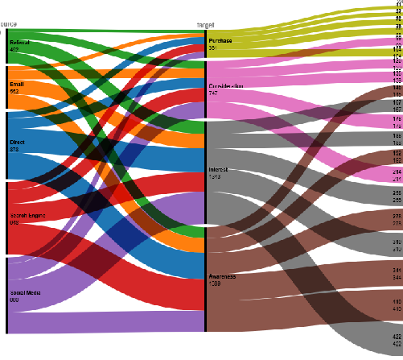

# Customer Journey Alluvial Diagram

This repository contains a RAWGraphs-generated **Alluvial Diagram** showing the customer journey from **Awareness → Interest → Consideration → Purchase** across multiple marketing channels.

- **Tool Used:** RAWGraphs.io (Alluvial Diagram)
- **Image Dimensions:** 400x400 px
- **Email:** 22f3001135@ds.study.iitm.ac.in  

## Files
- `chart.png` → Final visualization (Alluvial Diagram)
- `data.csv` → Source dataset used in RAWGraphs

## Visualization Context
Wehner Kiehn and Denesik requested this visualization for mapping **customer journeys** across channels.  
It highlights how customers flow from different sources (Direct, Social Media, Email, Search Engine, Referral) through the funnel stages.

